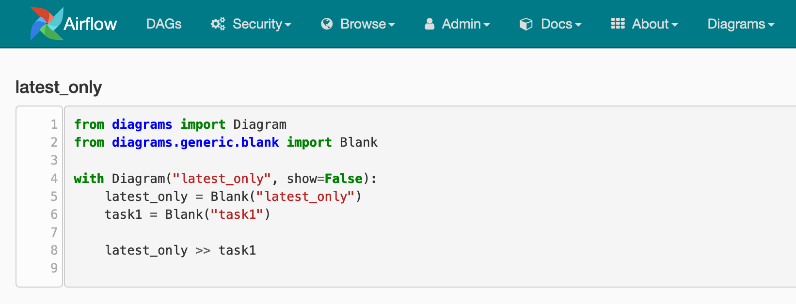

# airflow-diagrams-plugin

> An Airflow plugin to visualise [airflow-diagrams](https://github.com/feluelle/airflow-diagrams).

At the top right there will appear a `Diagrams` category where you can select `Diagram View` to see the code generated 
by airflow-diagrams.

## Installation

Copy and paste the `airflow_diagrams_plugin` folder to your Airflow plugins folder.

